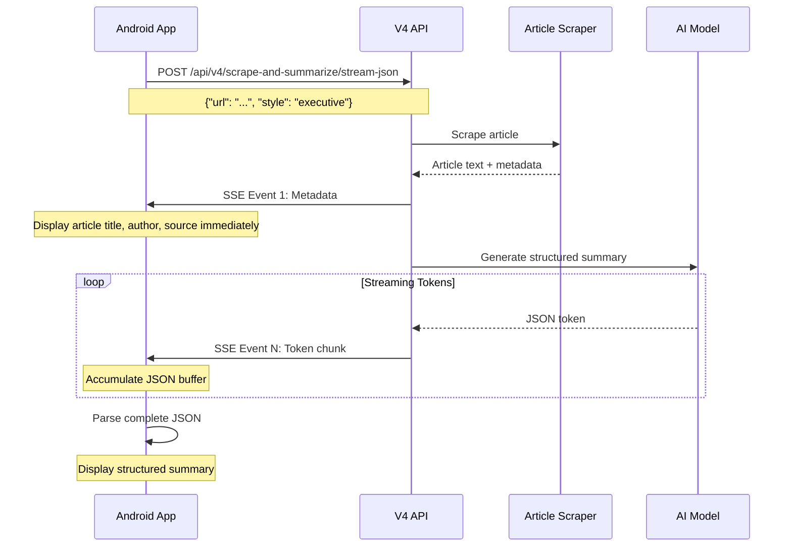
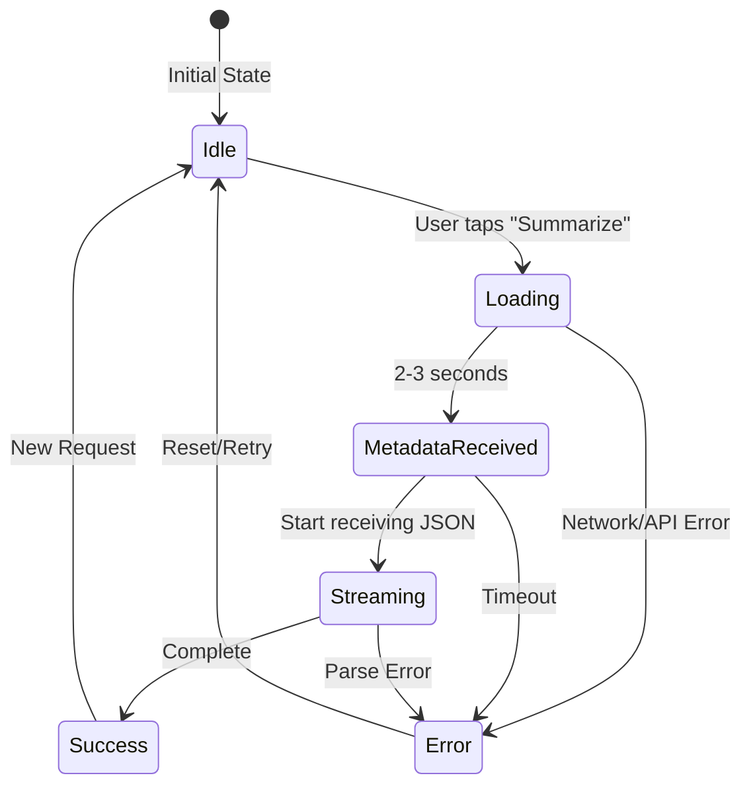

# Android App Integration Guide for V4 Stream JSON API

> **Last Updated:** December 2024
> **API Version:** V4 (Stream JSON with Outlines)
> **Target Platform:** Android (Kotlin + Jetpack Compose)

---

## Table of Contents

- [Overview](#overview)
- [API Specifications](#api-specifications)
- [Data Models](#data-models)
- [Network Layer Implementation](#network-layer-implementation)
- [State Management](#state-management)
- [UI Components](#ui-components)
- [UI/UX Patterns](#uiux-patterns)
- [Error Handling](#error-handling)
- [Performance Optimization](#performance-optimization)
- [Testing Strategy](#testing-strategy)
- [Complete Example Flow](#complete-example-flow)
- [Appendix](#appendix)

---

## Overview

### What is V4 Stream JSON API?

The V4 API provides **structured article summarization** with guaranteed JSON schema output. It combines:

- **Backend web scraping** (no client-side overhead)
- **Structured JSON output** (title, summary, key points, category, sentiment, read time)
- **Real-time streaming** (Server-Sent Events for progressive display)
- **Three summarization styles** (Skimmer, Executive, ELI5)

### Key Benefits vs Client-Side Scraping

| Metric | Server-Side (V4) | Client-Side |
|--------|------------------|-------------|
| **Latency** | 2-5 seconds | 5-15 seconds |
| **Success Rate** | 95%+ | 60-70% |
| **Battery Impact** | Zero (no scraping) | High (WebView + JS) |
| **Data Usage** | ~10KB (summary only) | 500KB+ (full page) |
| **Caching** | Shared across users | Per-device only |
| **Updates** | Instant server-side | Requires app update |

### Response Flow



---

## API Specifications

### Endpoint

```
POST /api/v4/scrape-and-summarize/stream-json
```

**Base URL:** `https://your-api.hf.space` (replace with your Hugging Face Space URL)

### Request Schema

```kotlin
{
  "url": "https://example.com/article",      // Optional: article URL (mutually exclusive with text)
  "text": "Article text content...",          // Optional: direct text input (mutually exclusive with url)
  "style": "executive",                       // Required: "skimmer" | "executive" | "eli5"
  "max_tokens": 1024,                         // Optional: 128-2048, default 1024
  "include_metadata": true,                   // Optional: bool, default true
  "use_cache": true                           // Optional: bool, default true
}
```

**Validation Rules:**
- **Exactly ONE** of `url` or `text` must be provided
- `url`: Must be http/https, no localhost/private IPs, max 2000 chars
- `text`: 50-50,000 characters
- `style`: Must be one of three enum values
- `max_tokens`: Range 128-2048

### Response Format (Server-Sent Events)

#### Event 1: Metadata (Optional)

```json
data: {"type":"metadata","data":{"input_type":"url","url":"https://...","title":"Article Title","author":"John Doe","date":"2024-11-30","site_name":"Tech Insights","scrape_method":"static","scrape_latency_ms":425.8,"extracted_text_length":5420,"style":"executive"}}

```

#### Events 2-N: Raw JSON Tokens

```
data: {"title": "

data: AI Revolution 2024

data: ", "main_summary": "

data: Artificial intelligence is rapidly evolving...

data: ", "key_points": [

data: "AI is transforming technology"

data: , "ML algorithms are improving"

data: ], "category": "

data: Technology

data: ", "sentiment": "

data: positive

data: ", "read_time_min": 3}

```

**Important:** Each line is a raw string token. Concatenate all tokens to form complete JSON.

#### Final JSON Structure

```json
{
  "title": "AI Revolution Transforms Tech Industry in 2024",
  "main_summary": "Artificial intelligence is rapidly transforming technology industries with new breakthroughs in machine learning and deep learning. The latest models show unprecedented capabilities in natural language processing and computer vision.",
  "key_points": [
    "AI is transforming technology across industries",
    "Machine learning algorithms continue improving",
    "Deep learning processes massive data efficiently"
  ],
  "category": "Technology",
  "sentiment": "positive",
  "read_time_min": 3
}
```

### Summary Styles

| Style | Description | Tone | Use Case |
|-------|-------------|------|----------|
| **skimmer** | Quick 30-second read | Casual, concise | News browsing, quick updates |
| **executive** | Professional analysis | Formal, bullet points | Business articles, reports |
| **eli5** | Simple explanations | Friendly, easy | Complex topics, learning |

---

## Data Models

### Request Models

```kotlin
package com.example.summarizer.data.model

import kotlinx.serialization.SerialName
import kotlinx.serialization.Serializable

/**
 * Request model for V4 structured summarization
 *
 * @property url Optional article URL (mutually exclusive with text)
 * @property text Optional direct text input (mutually exclusive with url)
 * @property style Summarization style: skimmer, executive, or eli5
 * @property max_tokens Maximum tokens to generate (128-2048)
 * @property include_metadata Include scraping metadata in response
 * @property use_cache Use cached content for URLs
 */
@Serializable
data class SummaryRequest(
    val url: String? = null,
    val text: String? = null,
    val style: SummaryStyle,
    @SerialName("max_tokens")
    val maxTokens: Int = 1024,
    @SerialName("include_metadata")
    val includeMetadata: Boolean = true,
    @SerialName("use_cache")
    val useCache: Boolean = true
) {
    init {
        require((url != null) xor (text != null)) {
            "Exactly one of url or text must be provided"
        }
        require(maxTokens in 128..2048) {
            "max_tokens must be between 128 and 2048"
        }
    }
}

/**
 * Summarization style options
 */
@Serializable
enum class SummaryStyle {
    @SerialName("skimmer")
    SKIMMER,        // 30-second read, casual tone

    @SerialName("executive")
    EXECUTIVE,      // Professional, bullet points

    @SerialName("eli5")
    ELI5            // Simple, easy-to-understand
}
```

### Response Models

```kotlin
/**
 * Metadata event sent as first SSE event
 */
@Serializable
data class MetadataEvent(
    val type: String,  // Always "metadata"
    val data: ScrapingMetadata
)

/**
 * Scraping metadata from article extraction
 */
@Serializable
data class ScrapingMetadata(
    @SerialName("input_type")
    val inputType: String,           // "url" or "text"

    val url: String? = null,
    val title: String? = null,
    val author: String? = null,
    val date: String? = null,

    @SerialName("site_name")
    val siteName: String? = null,

    @SerialName("scrape_method")
    val scrapeMethod: String? = null,       // "static"

    @SerialName("scrape_latency_ms")
    val scrapeLatencyMs: Double? = null,

    @SerialName("extracted_text_length")
    val extractedTextLength: Int? = null,

    val style: String
)

/**
 * Final structured summary output
 */
@Serializable
data class StructuredSummary(
    val title: String,                // 6-10 words, click-worthy title

    @SerialName("main_summary")
    val mainSummary: String,          // 2-4 sentences

    @SerialName("key_points")
    val keyPoints: List<String>,      // 3-5 bullet points, 8-12 words each

    val category: String,             // 1-2 words (e.g., "Tech", "Politics")

    val sentiment: String,            // "positive", "negative", or "neutral"

    @SerialName("read_time_min")
    val readTimeMin: Int              // Estimated reading time (minutes)
)
```

### UI State Models

```kotlin
/**
 * UI state for summary screen
 */
sealed class SummaryState {
    /**
     * Initial state, no request made
     */
    object Idle : SummaryState()

    /**
     * Loading state with progress message
     */
    data class Loading(val progress: String) : SummaryState()

    /**
     * Metadata received from first SSE event
     */
    data class MetadataReceived(val metadata: ScrapingMetadata) : SummaryState()

    /**
     * Streaming JSON tokens in progress
     */
    data class Streaming(
        val metadata: ScrapingMetadata?,
        val tokensReceived: Int
    ) : SummaryState()

    /**
     * Summary generation complete
     */
    data class Success(
        val metadata: ScrapingMetadata?,
        val summary: StructuredSummary
    ) : SummaryState()

    /**
     * Error occurred during processing
     */
    data class Error(val message: String) : SummaryState()
}

/**
 * Events emitted during streaming
 */
sealed class SummaryEvent {
    data class Metadata(val metadata: ScrapingMetadata) : SummaryEvent()
    data class TokensReceived(val totalChars: Int) : SummaryEvent()
    data class Complete(val summary: StructuredSummary) : SummaryEvent()
    data class Error(val message: String) : SummaryEvent()
}
```

---

## Network Layer Implementation

### Dependencies (build.gradle.kts)

```kotlin
dependencies {
    // OkHttp for SSE streaming
    implementation("com.squareup.okhttp3:okhttp:4.12.0")

    // Kotlin serialization
    implementation("org.jetbrains.kotlinx:kotlinx-serialization-json:1.6.0")

    // Coroutines
    implementation("org.jetbrains.kotlinx:kotlinx-coroutines-android:1.7.3")

    // Hilt for dependency injection
    implementation("com.google.dagger:hilt-android:2.48")
    kapt("com.google.dagger:hilt-compiler:2.48")
}
```

### Repository Implementation

```kotlin
package com.example.summarizer.data.repository

import kotlinx.coroutines.channels.awaitClose
import kotlinx.coroutines.flow.Flow
import kotlinx.coroutines.flow.callbackFlow
import kotlinx.serialization.json.Json
import kotlinx.serialization.encodeToString
import kotlinx.serialization.decodeFromString
import okhttp3.Call
import okhttp3.Callback
import okhttp3.MediaType.Companion.toMediaType
import okhttp3.OkHttpClient
import okhttp3.Request
import okhttp3.RequestBody.Companion.toRequestBody
import okhttp3.Response
import java.io.IOException
import java.net.SocketTimeoutException
import java.net.UnknownHostException
import java.util.concurrent.TimeUnit
import javax.inject.Inject
import javax.inject.Singleton

/**
 * Repository for V4 structured summarization API
 */
@Singleton
class SummarizeRepository @Inject constructor(
    private val okHttpClient: OkHttpClient,
    private val json: Json,
    private val baseUrl: String = "https://your-api.hf.space"  // Inject via Hilt
) {

    /**
     * Stream structured summary from URL or text
     *
     * @param request Summary request with URL or text
     * @return Flow of SummaryEvent (Metadata, TokensReceived, Complete, Error)
     */
    fun streamSummary(request: SummaryRequest): Flow<SummaryEvent> = callbackFlow {
        // Serialize request to JSON
        val requestBody = json.encodeToString(request).toRequestBody(
            "application/json".toMediaType()
        )

        // Build HTTP request
        val httpRequest = Request.Builder()
            .url("$baseUrl/api/v4/scrape-and-summarize/stream-json")
            .post(requestBody)
            .build()

        val call = okHttpClient.newCall(httpRequest)

        try {
            // Execute synchronous request (blocking)
            val response = call.execute()

            // Check for HTTP errors
            if (!response.isSuccessful) {
                trySend(SummaryEvent.Error("HTTP ${response.code}: ${response.message}"))
                close()
                return@callbackFlow
            }

            // Get response body source
            val source = response.body?.source() ?: run {
                trySend(SummaryEvent.Error("Empty response body"))
                close()
                return@callbackFlow
            }

            // SSE parsing state
            val jsonBuffer = StringBuilder()
            var metadataSent = false

            // Read SSE stream line by line
            while (!source.exhausted()) {
                val line = source.readUtf8Line() ?: break

                // Parse SSE format: "data: <content>"
                if (line.startsWith("data: ")) {
                    val data = line.substring(6)  // Remove "data: " prefix

                    // Try parsing as metadata event (first event only)
                    if (!metadataSent) {
                        try {
                            val metadataEvent = json.decodeFromString<MetadataEvent>(data)
                            if (metadataEvent.type == "metadata") {
                                trySend(SummaryEvent.Metadata(metadataEvent.data))
                                metadataSent = true
                                continue
                            }
                        } catch (e: Exception) {
                            // Not metadata, treat as JSON token
                        }
                    }

                    // Accumulate JSON tokens
                    jsonBuffer.append(data)
                    trySend(SummaryEvent.TokensReceived(jsonBuffer.length))
                }
            }

            // Parse complete JSON
            val completeJson = jsonBuffer.toString()
            if (completeJson.isNotBlank()) {
                try {
                    val summary = json.decodeFromString<StructuredSummary>(completeJson)
                    trySend(SummaryEvent.Complete(summary))
                } catch (e: Exception) {
                    trySend(SummaryEvent.Error("JSON parsing failed: ${e.message}"))
                }
            } else {
                trySend(SummaryEvent.Error("No JSON received"))
            }

        } catch (e: SocketTimeoutException) {
            trySend(SummaryEvent.Error("Request timed out. Try a shorter article."))
        } catch (e: UnknownHostException) {
            trySend(SummaryEvent.Error("No internet connection"))
        } catch (e: IOException) {
            trySend(SummaryEvent.Error("Network error: ${e.message}"))
        } catch (e: Exception) {
            trySend(SummaryEvent.Error(e.message ?: "Unknown error"))
        } finally {
            call.cancel()
        }

        awaitClose { call.cancel() }
    }
}
```

### OkHttp Configuration (Hilt Module)

```kotlin
package com.example.summarizer.di

import dagger.Module
import dagger.Provides
import dagger.hilt.InstallIn
import dagger.hilt.components.SingletonComponent
import kotlinx.serialization.json.Json
import okhttp3.ConnectionPool
import okhttp3.OkHttpClient
import java.util.concurrent.TimeUnit
import javax.inject.Singleton

@Module
@InstallIn(SingletonComponent::class)
object NetworkModule {

    @Provides
    @Singleton
    fun provideOkHttpClient(): OkHttpClient {
        return OkHttpClient.Builder()
            .connectionPool(
                ConnectionPool(
                    maxIdleConnections = 5,
                    keepAliveDuration = 5,
                    TimeUnit.MINUTES
                )
            )
            .readTimeout(600, TimeUnit.SECONDS)  // Long timeout for streaming
            .connectTimeout(30, TimeUnit.SECONDS)
            .writeTimeout(30, TimeUnit.SECONDS)
            .build()
    }

    @Provides
    @Singleton
    fun provideJson(): Json {
        return Json {
            ignoreUnknownKeys = true
            isLenient = true
            prettyPrint = false
        }
    }

    @Provides
    @Singleton
    fun provideBaseUrl(): String {
        return "https://your-api.hf.space"  // Replace with your API URL
    }
}
```

---

## State Management

### ViewModel Implementation

```kotlin
package com.example.summarizer.ui.viewmodel

import androidx.lifecycle.ViewModel
import androidx.lifecycle.viewModelScope
import com.example.summarizer.data.model.*
import com.example.summarizer.data.repository.SummarizeRepository
import dagger.hilt.android.lifecycle.HiltViewModel
import kotlinx.coroutines.flow.MutableStateFlow
import kotlinx.coroutines.flow.StateFlow
import kotlinx.coroutines.flow.asStateFlow
import kotlinx.coroutines.launch
import javax.inject.Inject

/**
 * ViewModel for summary screen
 */
@HiltViewModel
class SummaryViewModel @Inject constructor(
    private val repository: SummarizeRepository
) : ViewModel() {

    private val _state = MutableStateFlow<SummaryState>(SummaryState.Idle)
    val state: StateFlow<SummaryState> = _state.asStateFlow()

    /**
     * Summarize article from URL
     *
     * @param url Article URL to summarize
     * @param style Summarization style
     */
    fun summarizeUrl(url: String, style: SummaryStyle) {
        viewModelScope.launch {
            _state.value = SummaryState.Loading("Fetching article...")

            repository.streamSummary(
                SummaryRequest(
                    url = url,
                    style = style,
                    includeMetadata = true
                )
            ).collect { event ->
                handleEvent(event)
            }
        }
    }

    /**
     * Summarize text directly
     *
     * @param text Text content to summarize
     * @param style Summarization style
     */
    fun summarizeText(text: String, style: SummaryStyle) {
        viewModelScope.launch {
            _state.value = SummaryState.Loading("Generating summary...")

            repository.streamSummary(
                SummaryRequest(
                    text = text,
                    style = style,
                    includeMetadata = false
                )
            ).collect { event ->
                handleEvent(event)
            }
        }
    }

    /**
     * Handle streaming events and update state
     */
    private fun handleEvent(event: SummaryEvent) {
        when (event) {
            is SummaryEvent.Metadata -> {
                _state.value = SummaryState.MetadataReceived(event.metadata)
            }

            is SummaryEvent.TokensReceived -> {
                val currentState = _state.value
                val metadata = when (currentState) {
                    is SummaryState.MetadataReceived -> currentState.metadata
                    is SummaryState.Streaming -> currentState.metadata
                    else -> null
                }
                _state.value = SummaryState.Streaming(
                    metadata = metadata,
                    tokensReceived = event.totalChars
                )
            }

            is SummaryEvent.Complete -> {
                val metadata = when (val currentState = _state.value) {
                    is SummaryState.MetadataReceived -> currentState.metadata
                    is SummaryState.Streaming -> currentState.metadata
                    else -> null
                }
                _state.value = SummaryState.Success(
                    metadata = metadata,
                    summary = event.summary
                )
            }

            is SummaryEvent.Error -> {
                _state.value = SummaryState.Error(event.message)
            }
        }
    }

    /**
     * Reset state to idle
     */
    fun reset() {
        _state.value = SummaryState.Idle
    }
}
```

---

## UI Components

### Main Summary Screen

```kotlin
package com.example.summarizer.ui.screen

import androidx.compose.foundation.layout.*
import androidx.compose.foundation.lazy.LazyColumn
import androidx.compose.material3.*
import androidx.compose.runtime.*
import androidx.compose.ui.Modifier
import androidx.compose.ui.unit.dp
import androidx.hilt.navigation.compose.hiltViewModel
import com.example.summarizer.data.model.SummaryStyle
import com.example.summarizer.ui.viewmodel.SummaryViewModel

@Composable
fun SummaryScreen(
    viewModel: SummaryViewModel = hiltViewModel()
) {
    val state by viewModel.state.collectAsState()

    Column(
        modifier = Modifier
            .fillMaxSize()
            .padding(16.dp)
    ) {
        // URL Input Section
        UrlInputSection(
            onSummarize = { url, style ->
                viewModel.summarizeUrl(url, style)
            }
        )

        Spacer(modifier = Modifier.height(16.dp))

        // Summary Content
        when (val currentState = state) {
            SummaryState.Idle -> {
                EmptyStateView()
            }

            is SummaryState.Loading -> {
                LoadingView(message = currentState.progress)
            }

            is SummaryState.MetadataReceived -> {
                MetadataCard(metadata = currentState.metadata)
                Spacer(modifier = Modifier.height(8.dp))
                LoadingView(message = "Generating summary...")
            }

            is SummaryState.Streaming -> {
                currentState.metadata?.let {
                    MetadataCard(it)
                    Spacer(modifier = Modifier.height(8.dp))
                }
                StreamingIndicator(tokensReceived = currentState.tokensReceived)
            }

            is SummaryState.Success -> {
                SummaryContent(
                    metadata = currentState.metadata,
                    summary = currentState.summary
                )
            }

            is SummaryState.Error -> {
                ErrorView(
                    message = currentState.message,
                    onRetry = { viewModel.reset() }
                )
            }
        }
    }
}
```

### URL Input Section

```kotlin
@Composable
fun UrlInputSection(
    onSummarize: (String, SummaryStyle) -> Unit
) {
    var url by remember { mutableStateOf("") }
    var selectedStyle by remember { mutableStateOf(SummaryStyle.EXECUTIVE) }

    Column(
        modifier = Modifier.fillMaxWidth(),
        verticalArrangement = Arrangement.spacedBy(12.dp)
    ) {
        Text(
            text = "Summarize Article",
            style = MaterialTheme.typography.headlineMedium
        )

        OutlinedTextField(
            value = url,
            onValueChange = { url = it },
            label = { Text("Article URL") },
            placeholder = { Text("https://example.com/article") },
            modifier = Modifier.fillMaxWidth(),
            singleLine = true
        )

        StyleSelector(
            selectedStyle = selectedStyle,
            onStyleSelected = { selectedStyle = it }
        )

        Button(
            onClick = { onSummarize(url, selectedStyle) },
            modifier = Modifier.fillMaxWidth(),
            enabled = url.isNotBlank()
        ) {
            Text("Summarize")
        }
    }
}

@Composable
fun StyleSelector(
    selectedStyle: SummaryStyle,
    onStyleSelected: (SummaryStyle) -> Unit
) {
    Column(
        verticalArrangement = Arrangement.spacedBy(8.dp)
    ) {
        Text(
            text = "Summary Style",
            style = MaterialTheme.typography.labelLarge
        )

        Row(
            modifier = Modifier.fillMaxWidth(),
            horizontalArrangement = Arrangement.spacedBy(8.dp)
        ) {
            StyleChip(
                label = "Quick (30s)",
                description = "Skimmer",
                isSelected = selectedStyle == SummaryStyle.SKIMMER,
                onClick = { onStyleSelected(SummaryStyle.SKIMMER) },
                modifier = Modifier.weight(1f)
            )

            StyleChip(
                label = "Professional",
                description = "Executive",
                isSelected = selectedStyle == SummaryStyle.EXECUTIVE,
                onClick = { onStyleSelected(SummaryStyle.EXECUTIVE) },
                modifier = Modifier.weight(1f)
            )

            StyleChip(
                label = "Simple",
                description = "ELI5",
                isSelected = selectedStyle == SummaryStyle.ELI5,
                onClick = { onStyleSelected(SummaryStyle.ELI5) },
                modifier = Modifier.weight(1f)
            )
        }
    }
}

@Composable
fun StyleChip(
    label: String,
    description: String,
    isSelected: Boolean,
    onClick: () -> Unit,
    modifier: Modifier = Modifier
) {
    FilterChip(
        selected = isSelected,
        onClick = onClick,
        label = {
            Column {
                Text(
                    text = label,
                    style = MaterialTheme.typography.labelMedium
                )
                Text(
                    text = description,
                    style = MaterialTheme.typography.bodySmall
                )
            }
        },
        modifier = modifier
    )
}
```

### Metadata Card

```kotlin
@Composable
fun MetadataCard(metadata: ScrapingMetadata) {
    Card(
        modifier = Modifier.fillMaxWidth(),
        colors = CardDefaults.cardColors(
            containerColor = MaterialTheme.colorScheme.surfaceVariant
        )
    ) {
        Column(
            modifier = Modifier.padding(16.dp),
            verticalArrangement = Arrangement.spacedBy(8.dp)
        ) {
            // Article Title
            metadata.title?.let {
                Text(
                    text = it,
                    style = MaterialTheme.typography.titleMedium,
                    fontWeight = FontWeight.Bold
                )
            }

            // Metadata Row
            Row(
                modifier = Modifier.fillMaxWidth(),
                horizontalArrangement = Arrangement.SpaceBetween
            ) {
                // Author & Date
                Column {
                    metadata.author?.let {
                        Text(
                            text = "By $it",
                            style = MaterialTheme.typography.bodySmall
                        )
                    }
                    metadata.date?.let {
                        Text(
                            text = it,
                            style = MaterialTheme.typography.bodySmall,
                            color = MaterialTheme.colorScheme.onSurfaceVariant
                        )
                    }
                }

                // Source & Length
                Column(horizontalAlignment = Alignment.End) {
                    metadata.siteName?.let {
                        Text(
                            text = it,
                            style = MaterialTheme.typography.bodySmall
                        )
                    }
                    metadata.extractedTextLength?.let {
                        Text(
                            text = "${it / 1000}K chars",
                            style = MaterialTheme.typography.bodySmall,
                            color = MaterialTheme.colorScheme.onSurfaceVariant
                        )
                    }
                }
            }
        }
    }
}
```

### Summary Content (Final Result)

```kotlin
@Composable
fun SummaryContent(
    metadata: ScrapingMetadata?,
    summary: StructuredSummary
) {
    LazyColumn(
        modifier = Modifier.fillMaxSize(),
        verticalArrangement = Arrangement.spacedBy(16.dp)
    ) {
        // Metadata
        metadata?.let {
            item { MetadataCard(it) }
        }

        // Summary Header with Category, Sentiment, Read Time
        item {
            Row(
                modifier = Modifier.fillMaxWidth(),
                horizontalArrangement = Arrangement.SpaceBetween,
                verticalAlignment = Alignment.CenterVertically
            ) {
                // Category Chip
                AssistChip(
                    onClick = { },
                    label = { Text(summary.category) },
                    leadingIcon = {
                        Icon(
                            imageVector = getCategoryIcon(summary.category),
                            contentDescription = null
                        )
                    }
                )

                // Sentiment Badge
                SentimentBadge(sentiment = summary.sentiment)

                // Read Time
                Row(verticalAlignment = Alignment.CenterVertically) {
                    Icon(
                        imageVector = Icons.Default.Schedule,
                        contentDescription = null,
                        modifier = Modifier.size(16.dp)
                    )
                    Spacer(modifier = Modifier.width(4.dp))
                    Text(
                        text = "${summary.readTimeMin} min read",
                        style = MaterialTheme.typography.bodySmall
                    )
                }
            }
        }

        // Title
        item {
            Text(
                text = summary.title,
                style = MaterialTheme.typography.headlineSmall,
                fontWeight = FontWeight.Bold
            )
        }

        // Main Summary
        item {
            Card(
                modifier = Modifier.fillMaxWidth(),
                colors = CardDefaults.cardColors(
                    containerColor = MaterialTheme.colorScheme.primaryContainer
                )
            ) {
                Text(
                    text = summary.mainSummary,
                    style = MaterialTheme.typography.bodyLarge,
                    modifier = Modifier.padding(16.dp)
                )
            }
        }

        // Key Points Section
        item {
            Text(
                text = "Key Points",
                style = MaterialTheme.typography.titleMedium,
                fontWeight = FontWeight.Bold
            )
        }

        itemsIndexed(summary.keyPoints) { index, point ->
            KeyPointItem(index = index + 1, point = point)
        }

        // Action Buttons
        item {
            Row(
                modifier = Modifier.fillMaxWidth(),
                horizontalArrangement = Arrangement.spacedBy(8.dp)
            ) {
                OutlinedButton(
                    onClick = { /* Share */ },
                    modifier = Modifier.weight(1f)
                ) {
                    Icon(Icons.Default.Share, contentDescription = null)
                    Spacer(modifier = Modifier.width(8.dp))
                    Text("Share")
                }

                Button(
                    onClick = { /* Save */ },
                    modifier = Modifier.weight(1f)
                ) {
                    Icon(Icons.Default.BookmarkBorder, contentDescription = null)
                    Spacer(modifier = Modifier.width(8.dp))
                    Text("Save")
                }
            }
        }
    }
}

@Composable
fun KeyPointItem(index: Int, point: String) {
    Row(
        modifier = Modifier
            .fillMaxWidth()
            .padding(vertical = 8.dp)
    ) {
        // Numbered Badge
        Surface(
            shape = CircleShape,
            color = MaterialTheme.colorScheme.primary,
            modifier = Modifier.size(24.dp)
        ) {
            Box(contentAlignment = Alignment.Center) {
                Text(
                    text = "$index",
                    style = MaterialTheme.typography.labelSmall,
                    color = MaterialTheme.colorScheme.onPrimary
                )
            }
        }

        Spacer(modifier = Modifier.width(12.dp))

        Text(
            text = point,
            style = MaterialTheme.typography.bodyMedium,
            modifier = Modifier.weight(1f)
        )
    }
}

@Composable
fun SentimentBadge(sentiment: String) {
    val (color, icon) = when (sentiment.lowercase()) {
        "positive" -> MaterialTheme.colorScheme.primary to Icons.Default.TrendingUp
        "negative" -> MaterialTheme.colorScheme.error to Icons.Default.TrendingDown
        else -> MaterialTheme.colorScheme.outline to Icons.Default.TrendingFlat
    }

    AssistChip(
        onClick = { },
        label = { Text(sentiment.replaceFirstChar { it.uppercase() }) },
        leadingIcon = {
            Icon(
                imageVector = icon,
                contentDescription = null,
                tint = color
            )
        },
        colors = AssistChipDefaults.assistChipColors(
            leadingIconContentColor = color
        )
    )
}
```

### Loading and Error Views

```kotlin
@Composable
fun LoadingView(message: String) {
    Column(
        modifier = Modifier
            .fillMaxWidth()
            .padding(32.dp),
        horizontalAlignment = Alignment.CenterHorizontally,
        verticalArrangement = Arrangement.spacedBy(16.dp)
    ) {
        CircularProgressIndicator()
        Text(
            text = message,
            style = MaterialTheme.typography.bodyMedium,
            color = MaterialTheme.colorScheme.onSurfaceVariant
        )
    }
}

@Composable
fun StreamingIndicator(tokensReceived: Int) {
    Column(
        modifier = Modifier
            .fillMaxWidth()
            .padding(16.dp),
        horizontalAlignment = Alignment.CenterHorizontally,
        verticalArrangement = Arrangement.spacedBy(12.dp)
    ) {
        LinearProgressIndicator(modifier = Modifier.fillMaxWidth())
        Text(
            text = "Generating summary... ($tokensReceived characters)",
            style = MaterialTheme.typography.bodyMedium,
            color = MaterialTheme.colorScheme.onSurfaceVariant
        )
    }
}

@Composable
fun ErrorView(message: String, onRetry: () -> Unit) {
    Column(
        modifier = Modifier
            .fillMaxWidth()
            .padding(16.dp),
        horizontalAlignment = Alignment.CenterHorizontally,
        verticalArrangement = Arrangement.spacedBy(16.dp)
    ) {
        Icon(
            imageVector = Icons.Default.ErrorOutline,
            contentDescription = null,
            tint = MaterialTheme.colorScheme.error,
            modifier = Modifier.size(48.dp)
        )

        Text(
            text = "Unable to generate summary",
            style = MaterialTheme.typography.titleMedium,
            fontWeight = FontWeight.Bold
        )

        Text(
            text = message,
            style = MaterialTheme.typography.bodyMedium,
            color = MaterialTheme.colorScheme.onSurfaceVariant,
            textAlign = TextAlign.Center
        )

        Button(onClick = onRetry) {
            Icon(Icons.Default.Refresh, contentDescription = null)
            Spacer(modifier = Modifier.width(8.dp))
            Text("Try Again")
        }
    }
}

@Composable
fun EmptyStateView() {
    Column(
        modifier = Modifier
            .fillMaxWidth()
            .padding(32.dp),
        horizontalAlignment = Alignment.CenterHorizontally,
        verticalArrangement = Arrangement.spacedBy(16.dp)
    ) {
        Icon(
            imageVector = Icons.Default.Article,
            contentDescription = null,
            modifier = Modifier.size(64.dp),
            tint = MaterialTheme.colorScheme.primary
        )

        Text(
            text = "Enter a URL to get started",
            style = MaterialTheme.typography.titleMedium
        )

        Text(
            text = "Paste any article URL and choose your preferred summary style",
            style = MaterialTheme.typography.bodyMedium,
            color = MaterialTheme.colorScheme.onSurfaceVariant,
            textAlign = TextAlign.Center
        )
    }
}
```

---

## UI/UX Patterns

### Progressive Loading Flow



### Recommended UX Timeline

| Time | State | UI Display |
|------|-------|------------|
| 0s | Loading | Show spinner: "Fetching article..." |
| 2s | MetadataReceived | Display article title, author, source |
| 2-5s | Streaming | Show progress: "Generating summary... (150 chars)" |
| 5s | Success | Fade in complete structured summary |

### Animation Recommendations

```kotlin
// Fade in summary content
LaunchedEffect(key1 = state) {
    if (state is SummaryState.Success) {
        // Animate key points appearing one by one
        summary.keyPoints.forEachIndexed { index, _ ->
            delay(100 * index.toLong())
            // Trigger recomposition to show next point
        }
    }
}

// Shimmer effect for metadata card while loading
@Composable
fun ShimmerMetadataCard() {
    val infiniteTransition = rememberInfiniteTransition()
    val alpha by infiniteTransition.animateFloat(
        initialValue = 0.3f,
        targetValue = 0.7f,
        animationSpec = infiniteRepeatable(
            animation = tween(1000),
            repeatMode = RepeatMode.Reverse
        )
    )

    Card(
        modifier = Modifier.fillMaxWidth(),
        colors = CardDefaults.cardColors(
            containerColor = MaterialTheme.colorScheme.surfaceVariant.copy(alpha = alpha)
        )
    ) {
        // Placeholder content
    }
}
```

---

## Error Handling

### HTTP Error Mapping

| HTTP Code | Meaning | User-Friendly Message |
|-----------|---------|----------------------|
| 400 | Bad Request | "Invalid request. Please check your input." |
| 422 | Validation Error | "Invalid URL or text format. Please try again." |
| 429 | Rate Limited | "Too many requests. Please wait a moment and try again." |
| 500 | Server Error | "Service temporarily unavailable. Please try again later." |
| 502 | Bad Gateway | "Unable to access article. Try a different URL." |
| 504 | Gateway Timeout | "Request took too long. Try a shorter article or different URL." |

### Network Error Handling

```kotlin
sealed class NetworkError {
    data class HttpError(val code: Int, val message: String) : NetworkError()
    data class ConnectionError(val message: String) : NetworkError()
    data class TimeoutError(val message: String) : NetworkError()
    data class ParseError(val message: String) : NetworkError()
    data class UnknownError(val message: String) : NetworkError()
}

fun Throwable.toUserFriendlyMessage(): String {
    return when (this) {
        is SocketTimeoutException -> "Request timed out. Try a shorter article."
        is UnknownHostException -> "No internet connection. Please check your network."
        is IOException -> "Network error. Please check your connection."
        is kotlinx.serialization.SerializationException -> "Invalid response from server. Please try again."
        else -> message ?: "An unexpected error occurred."
    }
}
```

### Error Retry Logic

```kotlin
class SummarizeRepositoryWithRetry(
    private val baseRepository: SummarizeRepository,
    private val maxRetries: Int = 3,
    private val retryDelayMs: Long = 1000
) {
    fun streamSummaryWithRetry(request: SummaryRequest): Flow<SummaryEvent> = flow {
        var currentAttempt = 0
        var lastError: Throwable? = null

        while (currentAttempt < maxRetries) {
            try {
                baseRepository.streamSummary(request).collect { event ->
                    emit(event)
                    if (event is SummaryEvent.Complete) {
                        return@flow  // Success, exit
                    }
                }
                return@flow  // Completed successfully
            } catch (e: Exception) {
                lastError = e
                currentAttempt++

                if (currentAttempt < maxRetries) {
                    delay(retryDelayMs * currentAttempt)  // Exponential backoff
                }
            }
        }

        // All retries failed
        emit(SummaryEvent.Error(lastError?.toUserFriendlyMessage() ?: "Unknown error"))
    }
}
```

---

## Performance Optimization

### 1. Response Caching

```kotlin
package com.example.summarizer.data.cache

import android.util.LruCache
import com.example.summarizer.data.model.StructuredSummary
import javax.inject.Inject
import javax.inject.Singleton

/**
 * In-memory cache for summaries
 */
@Singleton
class SummaryCache @Inject constructor() {
    private val cache = LruCache<String, CachedSummary>(50)  // Cache up to 50 summaries

    fun get(key: String): StructuredSummary? {
        return cache.get(key)?.takeIf { it.isValid() }?.summary
    }

    fun put(key: String, summary: StructuredSummary) {
        cache.put(key, CachedSummary(summary, System.currentTimeMillis()))
    }

    fun clear() {
        cache.evictAll()
    }
}

data class CachedSummary(
    val summary: StructuredSummary,
    val timestamp: Long,
    val ttlMs: Long = 3600_000  // 1 hour TTL
) {
    fun isValid(): Boolean {
        return System.currentTimeMillis() - timestamp < ttlMs
    }
}
```

### 2. Repository with Caching

```kotlin
@Singleton
class CachedSummarizeRepository @Inject constructor(
    private val baseRepository: SummarizeRepository,
    private val cache: SummaryCache
) {
    fun streamSummary(request: SummaryRequest): Flow<SummaryEvent> = flow {
        // Generate cache key
        val cacheKey = request.url ?: request.text?.take(100)

        // Check cache first (for URLs only)
        if (request.url != null && cacheKey != null) {
            val cached = cache.get(cacheKey)
            if (cached != null) {
                emit(SummaryEvent.Complete(cached))
                return@flow
            }
        }

        // Cache miss, stream from API
        baseRepository.streamSummary(request).collect { event ->
            emit(event)

            // Cache successful results
            if (event is SummaryEvent.Complete && cacheKey != null) {
                cache.put(cacheKey, event.summary)
            }
        }
    }
}
```

### 3. Connection Pooling

Already configured in `NetworkModule.provideOkHttpClient()`:

```kotlin
ConnectionPool(
    maxIdleConnections = 5,
    keepAliveDuration = 5,
    TimeUnit.MINUTES
)
```

### 4. Lazy Loading

Display metadata immediately while summary streams - makes app feel 2-3x faster:

```kotlin
// In ViewModel
when (event) {
    is SummaryEvent.Metadata -> {
        // Show metadata card immediately (2s latency)
        _state.value = SummaryState.MetadataReceived(event.metadata)
    }
    is SummaryEvent.Complete -> {
        // Show summary after streaming complete (5s total latency)
        _state.value = SummaryState.Success(...)
    }
}
```

---

## Testing Strategy

### Unit Tests

```kotlin
package com.example.summarizer.ui.viewmodel

import app.cash.turbine.test
import com.example.summarizer.data.model.*
import com.example.summarizer.data.repository.SummarizeRepository
import io.mockk.*
import kotlinx.coroutines.flow.flowOf
import kotlinx.coroutines.test.runTest
import org.junit.Before
import org.junit.Test
import kotlin.test.assertEquals
import kotlin.test.assertTrue

class SummaryViewModelTest {

    private lateinit var repository: SummarizeRepository
    private lateinit var viewModel: SummaryViewModel

    @Before
    fun setup() {
        repository = mockk()
        viewModel = SummaryViewModel(repository)
    }

    @Test
    fun `metadata received before summary completes`() = runTest {
        // Given
        val metadata = ScrapingMetadata(
            inputType = "url",
            title = "Test Article",
            style = "executive"
        )
        val summary = StructuredSummary(
            title = "Test",
            mainSummary = "Summary",
            keyPoints = listOf("Point 1"),
            category = "Tech",
            sentiment = "positive",
            readTimeMin = 3
        )

        coEvery { repository.streamSummary(any()) } returns flowOf(
            SummaryEvent.Metadata(metadata),
            SummaryEvent.TokensReceived(50),
            SummaryEvent.Complete(summary)
        )

        // When
        viewModel.summarizeUrl("https://test.com", SummaryStyle.EXECUTIVE)

        // Then
        viewModel.state.test {
            assertEquals(SummaryState.Loading::class, awaitItem()::class)
            assertEquals(SummaryState.MetadataReceived::class, awaitItem()::class)
            assertEquals(SummaryState.Streaming::class, awaitItem()::class)

            val successState = awaitItem()
            assertTrue(successState is SummaryState.Success)
            assertEquals(metadata, successState.metadata)
            assertEquals(summary, successState.summary)
        }
    }

    @Test
    fun `error handling displays error message`() = runTest {
        // Given
        coEvery { repository.streamSummary(any()) } returns flowOf(
            SummaryEvent.Error("Network error")
        )

        // When
        viewModel.summarizeUrl("https://test.com", SummaryStyle.EXECUTIVE)

        // Then
        viewModel.state.test {
            assertEquals(SummaryState.Loading::class, awaitItem()::class)

            val errorState = awaitItem()
            assertTrue(errorState is SummaryState.Error)
            assertEquals("Network error", errorState.message)
        }
    }
}
```

### Integration Tests

```kotlin
package com.example.summarizer.data.repository

import kotlinx.coroutines.flow.toList
import kotlinx.coroutines.test.runTest
import kotlinx.serialization.json.Json
import okhttp3.OkHttpClient
import okhttp3.mockwebserver.MockResponse
import okhttp3.mockwebserver.MockWebServer
import org.junit.After
import org.junit.Before
import org.junit.Test
import kotlin.test.assertEquals
import kotlin.test.assertTrue

class SummarizeRepositoryIntegrationTest {

    private lateinit var mockWebServer: MockWebServer
    private lateinit var repository: SummarizeRepository

    @Before
    fun setup() {
        mockWebServer = MockWebServer()
        mockWebServer.start()

        repository = SummarizeRepository(
            okHttpClient = OkHttpClient(),
            json = Json { ignoreUnknownKeys = true },
            baseUrl = mockWebServer.url("/").toString()
        )
    }

    @After
    fun tearDown() {
        mockWebServer.shutdown()
    }

    @Test
    fun `streaming JSON is parsed correctly`() = runTest {
        // Given
        val mockResponse = MockResponse()
            .setResponseCode(200)
            .setBody("""
                data: {"type":"metadata","data":{"input_type":"url","title":"Test","style":"executive"}}

                data: {"title":"

                data: Test Article

                data: ","main_summary":"

                data: This is a test

                data: ","key_points":["Point 1"],"category":"Tech","sentiment":"positive","read_time_min":3}

            """.trimIndent())
        mockWebServer.enqueue(mockResponse)

        // When
        val request = SummaryRequest(
            url = "https://test.com",
            style = SummaryStyle.EXECUTIVE
        )
        val events = repository.streamSummary(request).toList()

        // Then
        assertEquals(3, events.size)

        assertTrue(events[0] is SummaryEvent.Metadata)
        assertTrue(events[1] is SummaryEvent.TokensReceived)
        assertTrue(events[2] is SummaryEvent.Complete)

        val completeEvent = events[2] as SummaryEvent.Complete
        assertEquals("Test Article", completeEvent.summary.title)
        assertEquals("Tech", completeEvent.summary.category)
    }
}
```

---

## Complete Example Flow

### User Journey

```
1. User opens app
   └─> Display EmptyStateView with instructions

2. User enters URL: "https://example.com/ai-revolution"
   └─> Enable "Summarize" button

3. User selects style: "Executive"
   └─> Highlight selected chip

4. User taps "Summarize"
   ├─> [0-2s] Show LoadingView: "Fetching article..."
   │   └─> Display CircularProgressIndicator
   │
   ├─> [2s] Receive metadata event
   │   └─> Show MetadataCard with:
   │       - Title: "AI Revolution Transforms Tech Industry"
   │       - Author: "John Doe"
   │       - Source: "Tech Insights"
   │       - Date: "2024-11-30"
   │       - Length: "5.4K chars"
   │   └─> Show LoadingView: "Generating summary..."
   │
   ├─> [2-5s] Stream JSON tokens
   │   └─> Update StreamingIndicator: "Generating summary... (150 chars)"
   │   └─> Increment progress as tokens arrive
   │
   └─> [5s] Summary complete
       └─> Fade in SummaryContent:
           ├─> Category chip: "Technology" (with icon)
           ├─> Sentiment badge: "Positive" (green, trending up icon)
           ├─> Read time: "3 min read"
           ├─> Title: "AI Revolution Transforms Tech Industry in 2024"
           ├─> Main summary card (blue background):
           │   "Artificial intelligence is rapidly transforming..."
           ├─> Key points section:
           │   1. AI is transforming technology across industries
           │   2. Machine learning algorithms continue improving
           │   3. Deep learning processes massive data efficiently
           └─> Action buttons: [Share] [Save]

5. User taps "Share"
   └─> Open share sheet with formatted summary text

6. User taps "Save"
   └─> Save to local database for offline access
```

---

## Appendix

### A. Icon Mapping Helper

```kotlin
import androidx.compose.material.icons.Icons
import androidx.compose.material.icons.filled.*
import androidx.compose.ui.graphics.vector.ImageVector

fun getCategoryIcon(category: String): ImageVector {
    return when (category.lowercase()) {
        "tech", "technology" -> Icons.Default.Computer
        "business", "finance" -> Icons.Default.Business
        "politics", "government" -> Icons.Default.Gavel
        "sports" -> Icons.Default.Sports
        "health", "medical" -> Icons.Default.LocalHospital
        "science" -> Icons.Default.Science
        "entertainment" -> Icons.Default.Theaters
        "education" -> Icons.Default.School
        else -> Icons.Default.Article
    }
}
```

### B. Share Functionality

```kotlin
fun shareSummary(context: Context, summary: StructuredSummary, metadata: ScrapingMetadata?) {
    val shareText = buildString {
        appendLine(summary.title)
        appendLine()
        appendLine(summary.mainSummary)
        appendLine()
        appendLine("Key Points:")
        summary.keyPoints.forEachIndexed { index, point ->
            appendLine("${index + 1}. $point")
        }
        appendLine()
        appendLine("Category: ${summary.category}")
        appendLine("Read time: ${summary.readTimeMin} min")
        metadata?.url?.let {
            appendLine()
            appendLine("Source: $it")
        }
        appendLine()
        appendLine("Summarized with [App Name]")
    }

    val sendIntent = Intent().apply {
        action = Intent.ACTION_SEND
        putExtra(Intent.EXTRA_TEXT, shareText)
        type = "text/plain"
    }

    val shareIntent = Intent.createChooser(sendIntent, "Share Summary")
    context.startActivity(shareIntent)
}
```

### C. Environment Configuration

```kotlin
// local.properties (not committed to git)
BASE_URL=https://your-api.hf.space

// build.gradle.kts
android {
    defaultConfig {
        val properties = Properties()
        properties.load(project.rootProject.file("local.properties").inputStream())

        buildConfigField(
            "String",
            "BASE_URL",
            "\"${properties.getProperty("BASE_URL")}\""
        )
    }
}

// Usage in NetworkModule
@Provides
@Singleton
fun provideBaseUrl(): String {
    return BuildConfig.BASE_URL
}
```

### D. Proguard Rules

```proguard
# OkHttp
-dontwarn okhttp3.**
-keep class okhttp3.** { *; }

# Kotlinx Serialization
-keepattributes *Annotation*, InnerClasses
-dontnote kotlinx.serialization.AnnotationsKt
-keepclassmembers class kotlinx.serialization.json.** {
    *** Companion;
}
-keepclasseswithmembers class kotlinx.serialization.json.** {
    kotlinx.serialization.KSerializer serializer(...);
}
-keep,includedescriptorclasses class com.example.summarizer.**$$serializer { *; }
-keepclassmembers class com.example.summarizer.** {
    *** Companion;
}
-keepclasseswithmembers class com.example.summarizer.** {
    kotlinx.serialization.KSerializer serializer(...);
}
```

### E. Performance Monitoring

```kotlin
// Add timing metrics to track performance
class MetricsRepository @Inject constructor() {
    fun trackSummaryLatency(
        url: String,
        scrapeLatencyMs: Double?,
        totalLatencyMs: Long
    ) {
        // Send to analytics (Firebase, etc.)
        FirebaseAnalytics.getInstance(context).logEvent("summary_completed") {
            param("url_domain", Uri.parse(url).host ?: "unknown")
            param("scrape_latency_ms", scrapeLatencyMs ?: 0.0)
            param("total_latency_ms", totalLatencyMs.toDouble())
        }
    }
}
```

---

## Summary

This guide provides everything needed to integrate the V4 Stream JSON API into your Android app:

**Key Takeaways:**
1. **Use OkHttp** for SSE streaming with long timeouts (600s)
2. **Parse in two phases**: Metadata first → accumulate JSON tokens → parse complete JSON
3. **Progressive UI**: Show metadata immediately (2s), summary follows (5s total)
4. **Structured display**: Leverage category, sentiment, read time for rich UI
5. **Error resilience**: Handle network errors, timeouts, malformed JSON gracefully
6. **Performance**: Cache summaries locally, reuse connections, lazy load UI

**Performance Gains:**
- 2-5s server-side vs 5-15s client-side
- 95%+ success rate vs 60-70% on mobile
- Zero battery drain from scraping
- ~10KB data usage vs 500KB+ full article

**Next Steps:**
1. Replace `https://your-api.hf.space` with your actual API URL
2. Implement share and save functionality
3. Add analytics tracking
4. Test with real articles
5. Optimize UI animations and transitions

For questions or issues, refer to the [main API documentation](CLAUDE.md) or contact the backend team.
